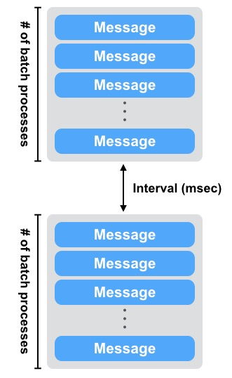
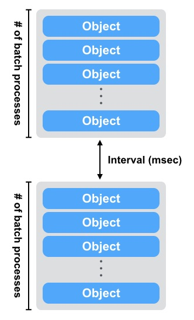

# LeoStorage Settings

## Prior Knowledge

!!! note "Note: Configuration"
    LeoStorage's features depend on its configuration. If once a LeoFS system is launched, you cannot modify the following LeoStorage's configurations because the algorithm of the data operation strictly adheres to the settings.


#### Irrevocable and Attention Required Items:

| Item                                   | Irrevocable?   | Description                              |
|----------------------------------------|----------------|------------------------------------------|
| **LeoStorage Basic**                   |
| obj_containers.path                    | Modifiable with condition | Able to change the directory of the container(s) but not able to add or remove the directory(s). You need to move the data files which are `<obj_containers.path>/avs/object` and `<obj_containers.path>/avs/metadata`, which adhere to this configuration. |
| obj_containers.num\_of\_containers     | Yes            | Not able to change the configuration because LeoStorage cannot retrieve objects or metadatas. |
| obj_containers.metadata\_storage       | Yes            | As above |
| num_of_vnodes`                         | Yes            | As above |
| **MQ**                                 |
| mq.backend\_db                         | Modifiable with condition | Lose all the MQ's data after changing |
| mq.num\_of\_mq\_procs                  | Modifiable with condition | As above |
| **Replication and Recovery object(s)** |
| replication.rack_awareness.rack_id     | Yes            | Not able to change the configuration because LeoFS cannot retrieve objects or metadatas. |
| **Other Directories Settings**         |
| queue_dir                              | Modifiable with condition | Able to change the MQ's directory but you need to move the MQ's data, which adhere to this configuration. |

### Other Configurations

If you want to modify settings like where to place `leo_storage.conf`, what user is starting a LeoStorage process and so on, refer [For Administrators / Settings / Environment Configuration](/admin/settings/environment_config.md) for more information.


## Configuration

### LeoStorage Configurations

| Item                                   | Description                              |
|----------------------------------------|------------------------------------------|
| **LeoManager Nodes**                   |
| managers                               | Name of LeoManager nodes. This configuration is necessary for communicating with `LeoManager's master` and `LeoManager's slave`.<p>( Default: [manager\_0@127.0.0.1, manager\_1@127.0.0.1] )</p> |
| **LeoStorage Basic**                   |
| obj\_containers.path                   | Directories of object-containers<p>( Default: [./avs] )</p> |
| obj\_containers.num\_of\_containers    | A number of object-containers of each directory. As **backend_db.eleveldb.write_buf_size** \* **obj\_containers.num\_of\_containers** memory can be consumed in total, take both into account to meet with your memory footprint requirements on LeoStorage. <p>( Default: [8] )</p> |
| obj\_containers.sync\_mode             | Mode of the data synchronization. There're three modes:<ul><li>`none`: Not synchronization every time *(default)*</li><li>`periodic`: Periodic synchronization which depends on `obj_containers.sync_interval_in_ms`</li><li>`writethrough`: Ensures that any buffers kept by the OS are written to disk every time</li></ul><p>( Default: none )</p> |
| obj\_containers.sync\_interval\_in\_ms | Interval in ms of the data synchronization<p>( Default: 1000, Unit: `msec` )</p> |
| obj\_containers.metadata\_storage      | The metadata storage feature is pluggable which depends on <a href="https://github.com/basho/bitcask" target="_blank">bitcask</a> and <a href="https://github.com/basho/eleveldb" target="blank">leveldb</a>.<p>( Default: leveldb )</p> |
| num\_of\_vnodes                        | The total number of virtual-nodes of a LeoStorage node for generating the distributed hashtable (RING)<p>( Default: 168 )</p> |
| object_storage.is\_strict\_check       | Enable strict check between checksum of a metadata and checksum of an object.<p>( Default: false )</p> |
| object_storage.threshold\_of\_slow\_processing |Threshold of slow processing<p>( Default: 1000, Unit: `msec` )</p> |
| seeking\_timeout\_per\_metadata        | Timeout of seeking metadatas per a metadata<p>( Default: 10, Unit: `msec` )</p> |
| max\_num\_of\_procs                    | Maximum number of processes for both write and read operation<p>( Default: 3000 )</p> |
| num\_of\_obj\_storage\_read\_procs     | Total number of obj-storage-read processes per object-container, AVS<ul><li>Range: [1..100]</li></ul><p>( Default: 3 )</p> |
| **Watchdog**                                   |
| watchdog.common.loosen_control_at_safe_count   | When reach a number of safe *(clear watchdog)*, a watchdog loosen the control<p>( Default: 1 )</p> |
| **Watchdog / REX**                             |
| watchdog.rex.is_enabled                        | Enables or disables the rex-watchdog which monitors the memory usage of *Erlang's RPC component*.<p>( Default: true )</p> |
| watchdog.rex.interval                          | An interval of executing the watchdog processing<p>( Default: 10, Unit: `sec` )</p>  |
| watchdog.rex.threshold_mem_capacity            | Threshold of memory capacity of binary for Erlang rex<p>( Default: 33554432, Unit: `byte` )</p> |
| **Watchdog / CPU**                             |
| watchdog.cpu.is_enabled                        | Enables or disables the CPU-watchdog which monitors both *CPU load average* and *CPU utilization*<p>( Default: false )</p> |
| watchdog.cpu.raised_error_times                | Times of raising error to a client<p>( Default: 5 )</p> |
| watchdog.cpu.interval                          | An interval of executing the watchdog processing<p>( Default: 10, Unit: `sec` )</p> |
| watchdog.cpu.threshold_cpu_load_avg            | Threshold of CPU load average<p>( Default: 5.0 )</p> |
| watchdog.cpu.threshold_cpu_util                | Threshold of CPU utilization<p>( Default: 100 )</p> |
| **Watchdog / DISK**                            |
| watchdog.disk.is_enabled                       | Enables or disables the <p>( Default: false )</p> |
| watchdog.disk.raised_error_times               | Times of raising error to a client<p>( Default: 5 )</p> |
| watchdog.disk.interval                         | An interval of executing the watchdog processing<p>( Default: 10, Unit: `sec` )</p> |
| watchdog.disk.threshold_disk_use               | Threshold of Disk use(%) of a target disk's capacity<p>( Default: 85, Unit: `percent` )</p> |
| watchdog.disk.threshold_disk_util              | Threshold of Disk utilization<p>( Default: 90, Unit: `percent` )</p> |
| watchdog.disk.threshold_disk_rkb               | Threshold of disk read KB/sec<p>( Default: 98304, Unit: `KB` )</p> |
| watchdog.disk.threshold_disk_wkb               | Threshold of disk write KB/sec<p>( Default: 98304, Unit: `KB` )</p> |
| watchdog.disk.target_devices                   | Target devices for checking disk utilization<p>( Default: [] )</p> |
| **Watchdog / CLUSTER**                         |
| watchdog.cluster.is_enabled                    | Enables or disables the <p>( Default: false )</p> |
| watchdog.cluster.interval                      | An interval of executing the watchdog processing<p>( Default: 10 )</p> |
| **Watchdog / ERRORS**                          |
| watchdog.error.is_enabled                      | Enables or disables the <p>( Default: false )</p> |
| watchdog.error.interval                        | An interval of executing the watchdog processing<p>( Default: 60 )</p> |
| watchdog.error.threshold_count                 | Total counts of raising error to a client<p>( Default: 100 )</p> |
| **Data Compaction**                                 |
| **Data Compaction / Basic**                         |
| compaction.limit_num_of_compaction_procs            | Limit of a number of procs to execute data-compaction in parallel<p>( Default: 4 )</p> |
| compaction.skip_prefetch_size                       | Perfetch size when skipping garbage<p>( Default: 512 )</p> |
| compaction.waiting_time_regular                     | Regular value of compaction-proc waiting time/batch-proc<p>( Default: 500, Unit: `msec` )</p> |
| compaction.waiting_time_max                         | Maximum value of compaction-proc waiting time/batch-proc<p>( Default: 3000, Unit: `msec` )</p> |
| compaction.batch_procs_regular                      | Total number of regular compaction batch processes<p>( Default: 1000 )</p> |
| compaction.batch_procs_max                          | Maximum number of compaction batch processes<p>( Default: 1500 )</p> |
| **Data Compaction / Automated Data Compaction**     |
| autonomic_op.compaction.is_enabled                  | Enables or disables the auto-compaction<p>( Default: false )</p> |
| autonomic_op.compaction.parallel_procs              | Total number of parallel processes<p>( Default: 1 )</p> |
| autonomic_op.compaction.interval                    | An interval time of between auto-comcations<p>( Default: 3600, Unit: `sec` )</p> |
| autonomic_op.compaction.warn_active_size_ratio      | Warning ratio of active size<p>( Default: 70, Unit: `percent` )</p> |
| autonomic_op.compaction.threshold_active_size_ratio | Threshold ratio of active size. LeoStorage start data-comaction after reaching it<p>( Default: 60, `percent` )</p> |
| **MQ**                                              |
| mq.backend_db | The MQ storage feature is pluggable which depends on <a href="https://github.com/basho/bitcask" target="_blank">bitcask</a> and <a href="https://github.com/basho/eleveldb" target="blank">leveldb</a>.<p>( Default: leveldb )</p> |
| mq.num_of_mq_procs                      | A number of mq-server's processes<p>( Default: 8 )</p> |
| mq.num_of_batch_process_max             | Maximum number of bach processes of message<p>( Default: 3000 )</p> |
| mq.num_of_batch_process_regular         | Regular value of bach processes of message<p>( Default: 1600 )</p> |
| mq.interval_between_batch_procs_max     | Maximum value of interval between batch-procs<p>( Default: 3000, Unit: `msec` )</p> |
| mq.interval_between_batch_procs_regular | Regular value of interval between batch-procs<p>( Default: 500, Unit: `msec` )</p> |
| **Backend DB / eleveldb**               |
| backend_db.eleveldb.write_buf_size | Write Buffer Size. Larger values increase performance, especially during bulk loads.<br/>Up to two write buffers may be held in memory at the same time, so you may wish to adjust this parameter to control memory usage.Also, a larger write buffer will result in a longer recovery time the next time the database is opened. As **backend_db.eleveldb.write_buf_size** \* **obj\_containers.num\_of\_containers** memory can be consumed in total, take both into account to meet with your memory footprint requirements on LeoStorage.<p>( Default: 62914560 )</p> |
| backend_db.eleveldb.max_open_files | Max Open Files. Number of open files that can be used by the DB. You may need to increase this if your database has a large working set *(budget one open file per 2MB of working set)*.<p>( Default: 1000 )</p> |
| backend_db.eleveldb.sst_block_size | The size of a data block is controlled by the SST block size. The size represents a threshold, not a fixed count. Whenever a newly created block reaches this uncompressed size, leveldb considers it full and writes the block with its metadata to disk. The number of keys contained in the block depends upon the size of the values and keys.<p>( Default: 4096 )</p> |
| **Replication and Recovery object(s)**    |
| replication.rack_awareness.rack_id        | *Rack-Id* for the rack-awareness replica placement feature |
| replication.recovery.size_of_stacked_objs | Size of stacked objects. Objects are stacked to send as a bulked object to remote nodes.<p>( Default: 5242880, Unit: `byte` )</p> |
| replication.recovery.stacking_timeout     | Stacking timeout. A bulked object are sent to a remote node after reaching the timeout.<p>( Default: 1, Unit: `sec` )</p>  |
| **Multi Data Center Replication / Basic** |
| mdc_replication.size_of_stacked_objs      | Size of stacked objects. Objects are stacked to send as a bulked object to a remote cluster.<p>( Default: 33554432, Unit: `byte` )</p> |
| mdc_replication.stacking_timeout          | Stacking timeout. A bulked object are sent to a remote cluster after reaching the timeout.<p>( Default: 30, Unit: `sec` )</p> |
| mdc_replication.req_timeout               | Request timeout between clusters<p>( Default: 30000, Unit: `msec` )</p> |
| **Log** |
| log.log_level               | Log level:<ul><li>0:debug</li><li>1:info</li><li>2:warn</li><li>3:error</li></ul><p>( Default: 1 )</p> |
| log.is_enable_access_log    | Enables or disables the access-log feature<p>( Default: false )</p> |
| log.access_log_level        | Access log's level:<ul><li>0: only regular case</li><li>1: includes error cases</li></ul><p>( Default: 0 )</p> |
| log.erlang                  | Destination of log file(s) of Erlang's log<p>( Default: ./log/erlang )</p> |
| log.app                     | Destination of log file(s) of LeoStorage<p>( Default: ./log/app )</p> |
| log.member_dir              | Destination of log file(s) of members of storage-cluster<p>( Default: ./log/ring )</p> |
| log.ring_dir                | Destination of log file(s) of RING<p>( Default: ./log/ring )</p> |
| log.is_enable_diagnosis_log | Destination of data-diagnosis log(s)<p>( Default: true )</p> |
| **Other Directories Settings**                      |
| queue_dir  | Directory of queue for monitoring "RING"<p>( Default: ./work/queue )</p> |
| snmp_agent | Directory of SNMP agent configuration<p>( Default: ./snmp/snmpa_storage_0/LEO-STORAGE )</p> |


### Erlang VM's Related Configurations

| Item                             | Description                             |
|----------------------------------|-----------------------------------------|
| nodename                         | The format of the node name is `<NAME>@<IP-ADDRESS>`, which must be unique always in a LeoFS system<p>( Default: storage_0@127.0.0.1 )</p> |
| distributed_cookie               | Sets the magic cookie of the node to `Cookie`. <br/><br/>- See also: <a href="http://erlang.org/doc/reference_manual/distributed.html" target="_blank">Distributed Erlang</a><p>( Default: 401321b4 )</p> |
| erlang.kernel_poll               | Kernel poll reduces LeoFS' CPU usage when it has hundreds (or more) network connections.<p>( Default: true )</p> |
| erlang.asyc_threads              | The total number of Erlang aynch threads<p>( Default: 32 )</p> |
| erlang.max_ports                 | The max_ports sets the default value of maximum number of ports.<br/><br/>- See also: [Erlang erlang:open_port/2](http://erlang.org/doc/man/erlang.html)<p>( Default: 64000 )</p> |
| erlang.crash_dump                | The output destination of an Erlang crash dump<p>( Default: ./log/erl_crash.dump )</p> |
| erlang.max_ets_tables            | The maxinum number of <a href="http://erlang.org/doc/man/ets.html" target="_blank">Erlagn ETS</a> tables<p>( Default: 256000 )</p> |
| erlang.smp                       | `-smp` enable and `-smp` start the Erlang runtime system with <a href="https://en.wikipedia.org/wiki/Symmetric_multiprocessing" target="_blank">SMP</a> support enabled.<p>( Default: enable )</p>|
| erlang.schedulers.compaction\_of\_load   | Enables or disables scheduler compaction of load. If it's enabled, the Erlang VM will attempt to fully load as many scheduler threads as mush as possible.<p>( Default: true )</p> |
| erlang.schedulers.utilization\_balancing | Enables or disables scheduler utilization balancing of load. By default scheduler utilization balancing is disabled and instead scheduler compaction of load is enabled, which strives for a load distribution that causes as many scheduler threads as possible to be fully loaded (that is, not run out of work).<p>( Default: false )</p> |
| erlang.distribution\_buffer\_size        | Sender-side network distribution buffer size *(unit: KB)*<p>( Default: 32768 )</p> |
| erlang.fullsweep\_after                  | Option fullsweep_after makes it possible to specify the maximum number of generational collections before forcing a fullsweep, even if there is room on the old heap. Setting the number to zero disables the general collection algorithm, that is, all live data is copied at every garbage collection.<p>( Default: 0 )</p> |
| erlang.secio                             | Enables or disables eager check I/O scheduling. The flag effects when schedulers will check for I/O operations possible to execute, and when such I/O operations will execute.<p>( Default: true )</p> |
| process_limit                            | The maxinum number of Erlang processes. Sets the maximum number of simultaneously existing processes for this system if a Number is passed as value. Valid range for Number is [1024-134217727]<p>( Default: 1048576 )</p> |


### Notes and Tips of the Configuration

#### obj\_containers.path, obj\_containers.num\_of\_containers

You can configure plural object containers with comma separated value of `obj_containers.path` and `obj_containers.num_of_containers`.

```ini
obj_containers.path = [/var/leofs/avs/1, /var/leofs/avs/2]
obj_containers.num_of_containers = [32, 64]
```

#### object\_storage.is\_strict\_check

Without setting `object_storage.is_strict_check ` to true, there is a little possibility your data could be broken without any caution even if a LeoFS system is running on a filesystem like ZFS[^1] that protect both the metadata and the data blocks through the checksum when bugs of any unexpected or unknown software got AVS files broken.

#### Configuration related to MQ

LeoStorage's MQ mechanism depends on the watchdog mechanism to reduce costs of a message consumption. The MQ dynamically updates `a number of batch processes` and `an interval of a message consumption`.


*Figure: Number-of-batch-processes and interval:*




As of Figure: Relationship of Watchdog and MQ, the watchdog can automatically adjust a value of `a number of batch processes` between `mq.num_of_batch_process_min` and `mq.num_of_batch_process_max`, which is increased or decreased with `mq.num_of_batch_process_step`.

On the other hands, a value of an interval is adjusted between `mq.interval_between_batch_procs_min` and `mq.interval_between_batch_procs_max`, which is increased or decreased with `mq.interval_between_batch_procs_step`.

When the each value reached the min value, the MQ changes the status to `suspending`, after that the node’s processing costs is changed to low, the MQ updates the status to `running`, again.


#### Configuration related to the auto-compaction

LeoStorage's auto-compaction mechanism also depends on the watchdog mechanism to reduce costs of processing. The Auto-compaction can dynamically update `a number of batch processes` and `an interval of a processing of seeking an object`. The basic design of the relationship with the watchdog is similar to the MQ.


*Figure: Number-of-batch-processes and interval*



As of *Figure: Relationship of the watchdog and the auto-compaction*, the watchdog automatically adjusts the value of *a number of batch processes* between `compaction.batch_procs_min` and `compaction.batch_procs_max`, which is increased or decreased with `compaction.batch_procs_step`.

On the other hand, the value of an interval is adjusted between `compaction.waiting_time_min` and `compaction.waiting_time_max`, which is increased or decreased with `compaction.waiting_time_step`.

When the each value reached the min value, the auto-compaction changes the status to `suspending`, after that the node’s processing costs is changed to low, the auto-compaction updates the status to `running`, again.


*Figure: Relationship of the watchdog and the auto-compaction*


## Related Links

- [Concept and Architecture / LeoStorage's Architecture](../../architecture/leo_storage.md)
- [For Administrators / System Operations / Cluster Operations](/admin/system_operations/cluster.md)
- [For Administrators / System Operations / Data Operations](/admin/system_operations/data.md)
- [For Administrators / Settings / Environment Configuration](/admin/settings/environment_config.md)


[^1]: <a href="https://en.wikipedia.org/wiki/ZFS" target="_blank">ZFS</a>
