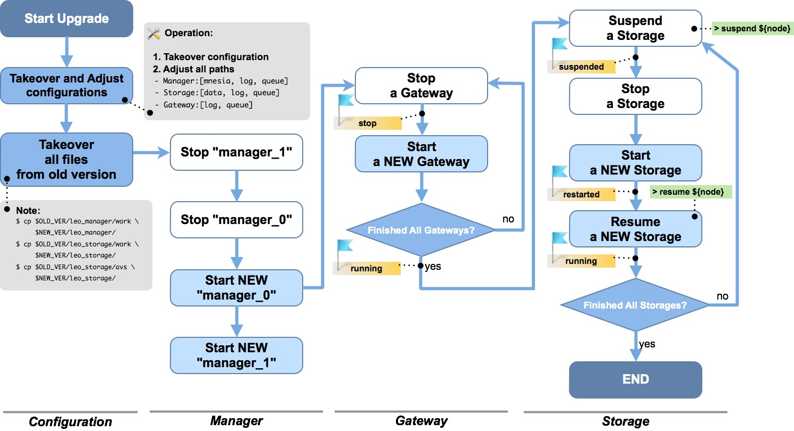

# System Migration

## Upgrade an older LeoFS version to the latest one
### Operation Flow

If you would like to migrate a LeoFS system, you can achieve that by following the operation flow.



- <a href="../../../assets/leofs-upgrade-flow-diagram.jpg" target="_blank">See the large diagram</a>

#### Takeover and Adjust Confugurations

Before getting started with the migration of a LeoFS system, you need to take over the configuration, then adjust the paths and set the new configurations.
It is possible to simplify this by storing node configuration in `/etc/leofs`, independent on version. Please refer to [For Administrators / System Administration / Persistent Configuration](/admin/system_admin/persistent_configuration.md) for instructions on enabling and using this feature.


#### Added Or Changed LeoFS' Configurations
##### LeoManager Master

**[since v1.3.3]** LeoFS' MDC replication feature was improved. Some configuration are added in [the configuration of LeoManager's master](https://github.com/leo-project/leofs/blob/master/apps/leo_manager/priv/leo_manager_0.conf).


```ini
## --------------------------------------------------------------------
## MANAGER - Multi DataCenter Settings
## --------------------------------------------------------------------
## A number of replication targets
mdc_replication.max_targets = 2

## A number of replicas per a datacenter
## [note] A local LeoFS sends a stacked object which contains an items of a replication method:
##          - [L1_N] A number of replicas
##          - [L1_W] A number of replicas needed for a successful WRITE operation
##          - [L1_R] A number of replicas needed for a successful READ operation
##          - [L1_D] A number of replicas needed for a successful DELETE operation
##       A remote cluster of a LeoFS system which receives its object,
##       and then replicates it by its contained reoplication method.
mdc_replication.num_of_replicas_a_dc = 1

## MDC replication / A number of replicas needed for a successful WRITE operation
mdc_replication.consistency.write = 1

## MDC replication / A number of replicas needed for a successful READ operation
mdc_replication.consistency.read = 1

## MDC replication / A number of replicas needed for a successful DELETE operation
mdc_replication.consistency.delete = 1
```

##### LeoStorage

**[since v1.3.3]** Data synchronization configuration are added in [the configuration of LeoStorage](https://github.com/leo-project/leofs/blob/master/apps/leo_storage/priv/leo_storage.conf).

```ini
## Mode of the data synchronization - [none, periodic, writethrough]
## - default:none
obj_containers.sync_mode = none

## Interval in ms of the data synchronization - default: 1000ms
obj_containers.sync_interval_in_ms = 1000
```


### Changes in LeoFS' Packages (1.3.8+)

Starting from v1.3.8 there are changes in [the official Linux packages](http://leo-project.net/leofs/download.html). They should work out of the box for new installations and for new nodes on existing installations. However, one needs to pay special attention during upgrading existing nodes to v1.3.8.

- for all supported distributions: there is now symlink `/usr/local/leofs/current` which points to `/usr/local/leofs/<version>`, this allows fixed path to launch scripts, independent of LeoFS version (e.g. `/usr/local/leofs/current/leo_manager_0/bin/leo_manager`). Users that created symlink with that name themselves should remove it before installing new package.
- for EL6 / EL7 packages: installing multiple versions of LeoFS package is not supported anymore. There can be only one version of `leofs` package installed in system; new version should only be installed as upgrade, with `rpm -U` / `rpm -F`.
- for systemd-based distributions (Ubuntu 16.04, EL7) special upgrade steps are needed.

#### Procedure of installing v1.3.8 upgrade for systemd-based distributions (Ubuntu 16.04 and EL7)

When upgrading existing node running LeoFS package 1.3.7 or earlier to v1.3.8 or later, please follow these steps:

- Stop currently running LeoFS node. Backup current config files for that node, if needed.
- Execute `pgrep -a epmd` and make sure there is **no output**, i.e. no instances of epmd are running. If there are any, kill them with `pkill epmd` command. Never kill `epmd` while LeoFS node is still running, though, because it will render it non-functional until restart.
- For EL7, execute `rpm -q leofs` and make sure that no more than single version of package is installed.
- Upgrade to new package version (dpkg -i for Ubuntu 16.04, rpm -U for EL7). After that, follow the usual procedure for LeoFS upgrade between versions.

If an error was made and epmd wasn't stopped before installation of the new package, an error similar to this will appear during package upgrade:
```
Job for leofs-epmd.socket failed. See "systemctl status leofs-epmd.socket" and "journalctl -xe" for details.
```

In that case, users must do the following before trying to start the new version:

- After making sure that LeoFS nodes aren't running on this system, kill running epmd instance (e.g. `pkill epmd`)
- Execute `systemctl start leofs-epmd.socket` - there should be no output if everything was done correctly

(or, alternatively, system reboot will take care of this problem as well).

These special steps are not needed for installing upgrades after v1.3.8.

After upgrade, users of systemd-based distributions might be interested in switching to new way of launching nodes which offers improvements for system administration and new features like automatic startup/shutdown of LeoFS node on startup or reboot. Please read [For Administrators / System Operations / Systemd Services](/admin/system_operations/systemd.md) for more information.

### Changes in LeoFS' Packages (1.3.3+)

Starting from v1.3.3, all LeoFS nodes are running as non-privileged user `leofs` in [the official Linux packages](http://leo-project.net/leofs/download.html). It should work out of the box for new installations and for new nodes on existing installations. However, for existing nodes upgrading to v1.3.3 *(or later)* from previous versions, the change might be not seamless.


### Extra Steps
#### Running LeoFS with Default Paths

For those who have LeoFS configured with:

- `queue` and `mnesia` in `/usr/local/leofs/<version>/leo_*/work`
- `log files` in `/usr/local/leofs/<version>/leo_*/log`
- LeoStorage data files in `/usr/local/leofs/<version>/leo_storage/avs`

#### Procedures
##### Migrate Files and Directories

During upgrade of node *(of any type)*, **after** stopping the old version and copying or moving every files to be moved into the new directories, change the owner with the commands below. It has to be done **before** launching the
new version.

```
# chown -R leofs:leofs /usr/local/leofs/%version/leo_storage/avs
# chown -R leofs:leofs /usr/local/leofs/%version/leo_gateway/cache
# chown -R leofs:leofs /usr/local/leofs/%version/leo_*/log
# chown -R leofs:leofs /usr/local/leofs/%version/leo_*/work
```

##### Remove Unnecessary Directories

Remove old temporary directory used by launch scripts. This step is needed because when earlier version was launched with `root` permissions, it creates a set of temporary directories in `/tmp` which cannot be re-used by non-privileged user as is, and launch scripts will fail with obscure messages - or with no message at all, except for an error in syslog *(usually `/var/log/messages`)*.

```
# rm -rf /tmp/usr
```

##### Re-launch the System

Start the node through its launch script, as per upgrade flow diagram.


#### Running LeoFS with customized paths

For those who have LeoFS configured with, for example:

- `queue` and `mnesia` in `/mnt/work`
- `log files` in `/var/log/leofs`
- LeoStorage data files in `/mnt/avs`


1. Before starting new version of a node, execute `chown -R leofs:leofs <..>` for all these external directories

2. Don't forget to remove temporary directory *(`rm -rf /tmp/usr`)* as well for the reasons described above.

These users might be interested in new features of `environment config files`, which allow to redefine some environment variables like paths in launch script.

Refer [For Administrators / Settings / Environment Configuration](/admin/settings/environment_config.md) for more information.


#### Running LeoFS with customized launch scripts

For those who have LeoFS already running as non-privileged user.

1. Scripts that are provided by packages generally should be enough to run on most configurations without changes. If needed, change user from `leofs` to some other in "environment" config files *(e.g. `RUNNER_USER=localuser`)*. Refer to the later section for more details about environment config files.

2. Possible pitfall includes ownership of `/usr/local/leofs/.erlang.cookie` file, which is set to `leofs` during package installation. This should only be a problem when trying to run LeoFS nodes with permissions of some user which is not called `leofs`, but has home directory set to `/usr/local/leofs`. This is not supported due to technical reasons. Home directory of that user must be set to something else.


#### Running LeoFS in any form and keeping LeoFS running as `root`

For those who want to keep maximum compatibility with the previous installation.
In `environment config file`, set `RUNNER_USER`:

```ini
RUNNER_USER=root
```

Note that switching this node to run as non-privileged user later will require extra steps to carefully change all permissions. This is not recommended, but possible *(at very least, in addition to `chown` commands from before, permissions of `leo_*/etc` and `leo_*/snmp/*/db` will have to be changed recursively as well)*.


## Note for Developers

As described at the previous section, the default user running LeoFS processes has changed to `leofs` so that requires developers to

- Tweak environment config files to set `RUNNER_USER` to the user you have logged in while developing with ```make release/bootstrap.sh/mdcr.sh```.
- Remove all files under `$PIPE_DIR` before starting any LeoFS processes.


## Related Links

- [For Administrators / System Administration / Persistent Configuration Location](/admin/system_admin/persistent_configuration.md)
- [For Administrators / Settings / Environment Configuration](/admin/settings/environment_config.md)
- [For Administrators / Settings / LeoManager Settings](/admin/settings/leo_manager.md)
- [For Administrators / Settings / LeoStorage Settings](/admin/settings/leo_storage.md)
- [For Administrators / Settings / LeoGateway Settings](/admin/settings/leo_gateway.md)
- [For Administrators / System Operations / Systemd Services](/admin/system_operations/systemd.md)
