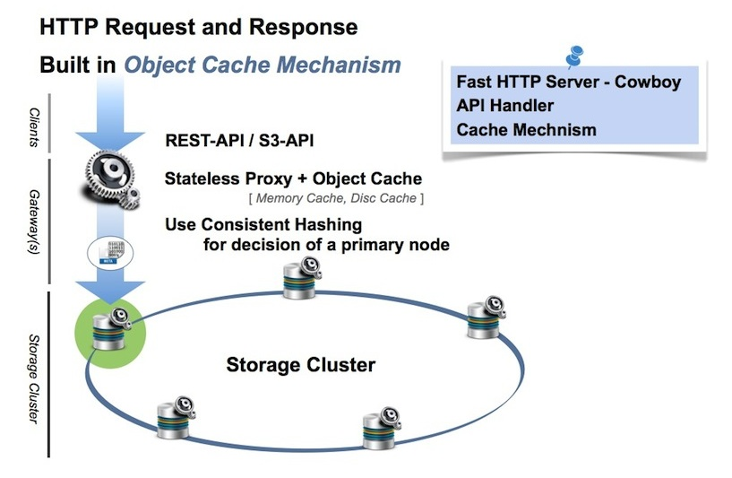

# LeoGateway's Architecture

LeoGateway consists of the fast HTTP server which is <a href="https://github.com/ninenines/cowboy" target="_blank">Cowboy</a>, the multi-protocols handler, and the object cache. It provides multi-protocols which are the RESTful API, <a href="http://docs.aws.amazon.com/AmazonS3/latest/API/Welcome.html" target="_blank">Amazon S3-API</a>, and NFS v3. If you adopt using Amazon S3-API, you can easily access LeoFS with S3 clients which include <a href="http://s3tools.org/s3cmd" target="_blank">s3cmd</a>, <a href="http://www.s3-client.com/" target="_blank">DragonDisk</a> and AWS SDKs - <a href="https://aws.amazon.com/sdk-for-java/" target="_blank">Java</a>, <a href="https://aws.amazon.com/sdk-for-ruby/" target="_blank">Ruby</a>, <a href="https://docs.aws.amazon.com/sdk-for-go/api/service/s3/" target="_blank">Go</a>, <a href="https://aws.amazon.com/sdk-for-python/" target="_balnk">Python (Boto3)</a> and others.

A client requests an object or a bucket operation to a LeoGateway node, then it requests the message of an operation to a LeoStorage node.

A destination LeoStorage node is decided by RING *(distributed hash table)*, which is generated and distributed at LeoManager nodes.

LeoGateway also provides built-in support for the object cache to realize keeping high performance and reduction of traffic between LeoGateway nodes and LeoStorage nodes.

## Related Links

- [For Administrators / Settings / LeoGateway Settings](/admin/settings/leo_gateway.md)
- [For Administrators / Interface / S3-API](/admin/protocols/s3.md)
- [For Administrators / Interface / REST-API](/admin/protocols/rest.md)
- [For Administrators / Interface / NFS v3](/admin/protocols/nfs_v3.md)
- [For Administrators / System Operations / S3-API related Operations](/admin/system_operations/s3.md)