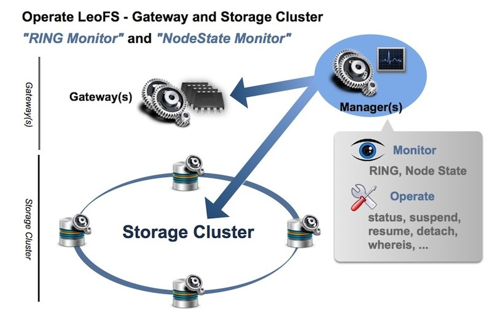

# LeoManager's Architecture

LeoManager monitors the state of LeoGateway and LeoStorage nodes to keep the high availability of a LeoFS system. A consistency of RING (*distributed hash table*) of LeoGateway and LeoStorage nodes are always monitored by LeoManager to prevent <a href="https://en.wikipedia.org/wiki/Split-brain" target="_blank">split-brain</a>.

Both LeoManager nodes manage configurations of a system and information of every node to be able to recover a system reliability, and the data are replicated by <a href="http://erlang.org/doc/man/mnesia.html" target="_blank">Erlang Mnesia</a> to avoid data loss.

LeoManager provides [leofs-adm as a LeoFS administration commands](../admin/index_of_commands.md) to be able to operate LeoFS quickly. The administration commands already cover entire LeoFS features.

## Related Links

- [For Administrators / Index of LeoFS' Commands](/admin/index_of_commands.md)
- [For Administrators / Settings / LeoManager Settings](/admin/settings/leo_manager.md)