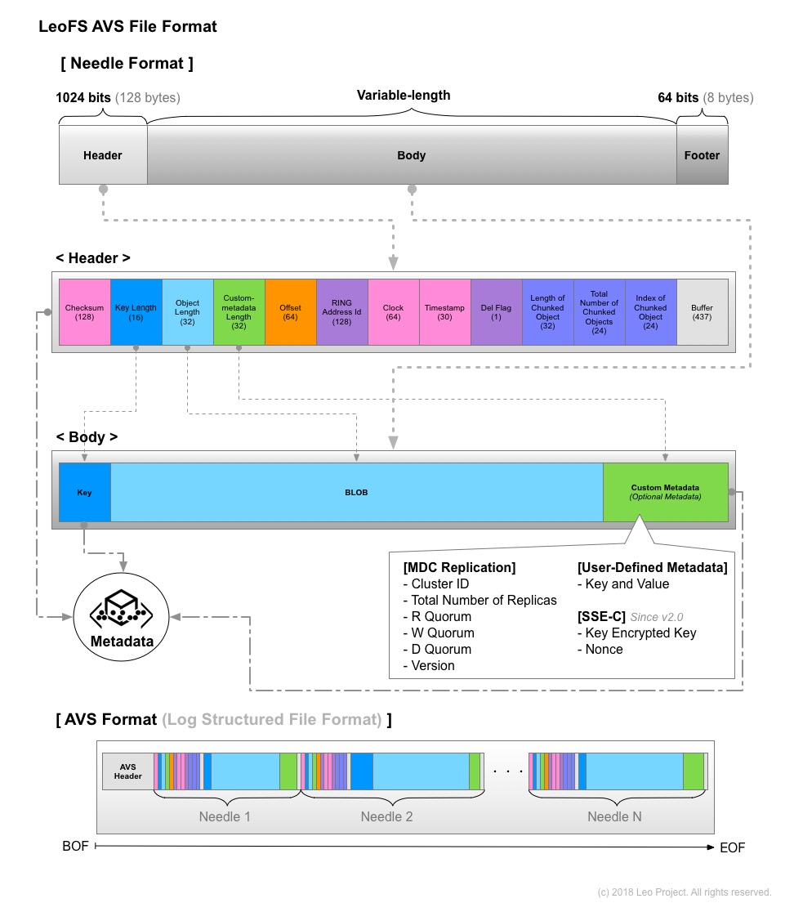

# LeoStorage's Architecture

## Fundamentals

LeoStorage consists of **the object storage** and **the metadata storage**, and it includes replicator and repairer realize eventual consistency.

### WRITE-Request Handling

A LeoStorage node accepts a request from a LeoGateway node then automatically replicate an object into the LeoStorage cluster. Finally, its LeoStorage node confirms whether a stored object satisfies the consistency rule.

### READ-Request Handling

A LeoGateway node requests a LeoStorage node; then its LeoStorage node retrieves an object from the local object-storage or a remote LeoStorage node. Finally, its LeoStorage node responds an object to its LeoGateway node. Also, its LeoStorage node checks the consistency with the asynchronous processing. Please note that [LeoGateway cache settings](/admin/settings/leo_gateway/#cache-consistency-between-leogateway-and-leostorage) can affect requests handling.

If its LeoStorage node finds inconsistency of an object, its node fixes the inconsistent object with the backend process. Its object eventually keeps consistency with the functions.

## Data Structure

LeoFS' object consists of three layers which are as below:

* **Metadata** *(attributes of an object)* which is stored into **Metadata Store** and the header of a Needle
* **Needle** which is a part of an AVS file
* **AVS**[^1] which is an object-container of LeoStorage

**LeoStorage** manages and stores both an object and metadata which are stored in AVS. Furthermore, metadata is redundantly stored in Metadata Store in order to be able to transform metadata to each other for durability. Metadata Store utilizes LevelDB[^2].

AVS is a log structured file format. It is robust and costly seeks are kept to a minimum whereas LeoStorage needs to remove unnecessary objects from AVS with the data compaction.

## Large Object Support

LeoFS supports handling a large size object since v0.12. The purpose of this feature is two things:

* To equalize disk usage of each LeoStorage node.
* To realize high I/O efficiency and high availability.

### WRITE-Request Handling

A LeoGateway node divides a large size object into plural objects, then those chunks are replicated into a LeoStorage cluster which is similar to handling small size objects, and the default chunk size is 5MB, the configuration of which can change a custom chunked object size.

### READ-Request Handling

A LeoGateway node retrieves a metadata of a requested object, then if it's a large size object, its LeoGateway node retrieves the chunked objects in order of the fragment object number from the LeoStorage cluster. Finally, its LeoGateway node responds the objects to the client.

## Related Links

- [For Administrators / Settings / LeoStorage Settings](/admin/settings/leo_storage.md)
- [For Administrators / System Operations / Cluster Operations](/admin/system_operations/cluster.md)

[^1]: AVS - ARIA Vector Storage. ARIA is the old name of LeoFS.
[^2]: <a href="http://leveldb.org/" target="_blank">LevelDB</a>
