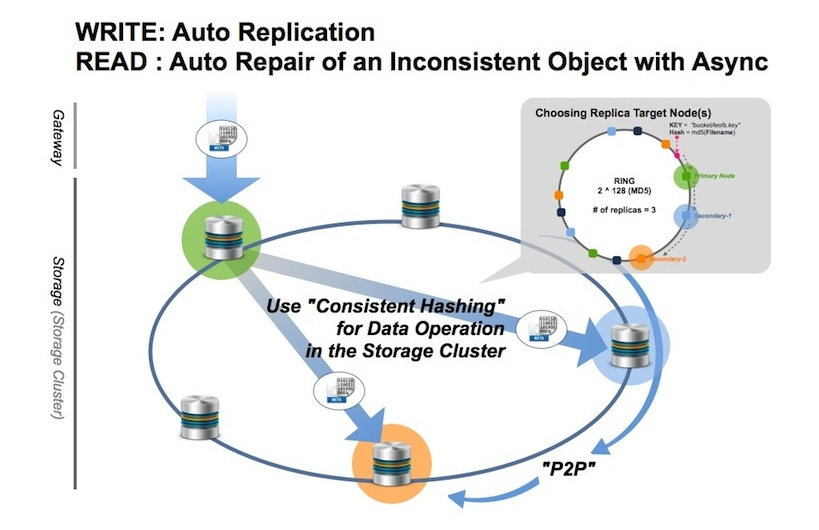
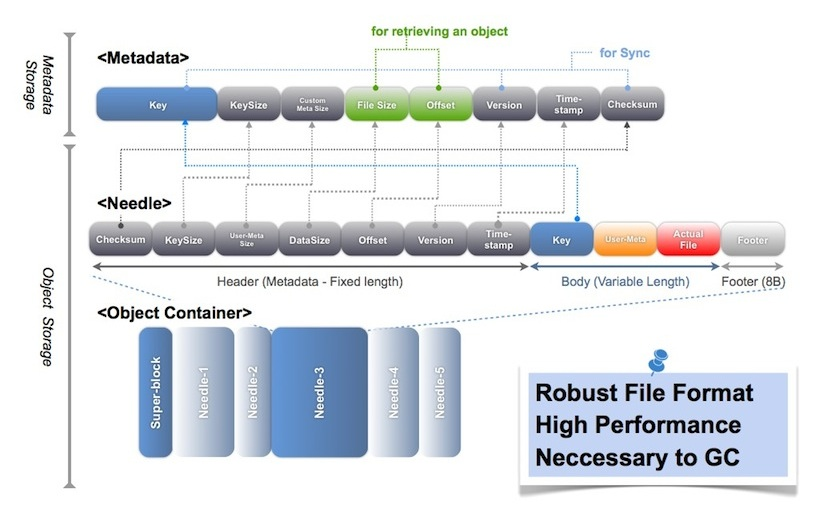

# LeoStorage's Architecture

## Fundamentals

LeoStorage consists of `the object storage` and `the metadata storage`, and it includes replicator and repairer realise eventual consistency.

### WRITE Request Handling

LeoStorage accepts a request from LeoGateway then automatically replicate an object into the LeoStorage cluster. Finally, LeoStorage confirms whether a stored object satisfy the consistency rule.

### READ Request Handling

LeoGateway requests a LeoStorage node, then the LeoStorage node retrieves an object from the local object-storage or a remote LeoStorage node. Finaly, the LeoStorage node responds an object to the gateway. Also, the LeoStorage node checks consistency of the object with the asynchronous processing.

If the LeoStorage node finds inconsistency of an object, the inconsistency object will be recovered with the backend process. The object eventually keeps consistensy with their functions.

## Data Structure

LeoFS’ object consists of 3 layers which are `metadata`, `needle` and `object container`.

* The object storage manages and stores both an object and a metadata, which merges as a needle.
* The metadata storage manages and stores attributes of an object which includes filename, size, checksum, and others, and it depends of <a href="" target="_blank">leveldb</a>.
* The object container adopts a log structured file format.
    * The format is robust and high performance because effect of local file system is just a little part.
    * LeoStorage is necessary to remove unnecessary objects from the object-containers, which is realised by the data-compaction feature.

## Large Object Support

LeoFS supports handling a large size object since v0.12. The purpose of this feature is 2 things:

* To equalize disk usage of each LeoStorage node.
* To realise high I/O efficiency and high availability.

### WRITE Request Handling

A large size object is divided to plural objects at LeoGateway's node, then those chunks is replicated into the LeoStorage cluster which is similar with handling small size objects, and the default chunk size is 5MB, the configuration of which is able to change a custom chunked object size.

### READ Request Handling

LeoGateway retrieves a metadata of a requested object, then if it's a large size object, LeoGateway retrieves the chunked objects in order of the chunk object number from the LeoStorage cluster. Finally, LeoGateway responds the objects to the client.

## Related Links

- [For Administrators / Settings / LeoStroage Settings](/admin/settings/leo_storage.md)
- [For Administrators / System Operations / Cluster Operations](/admin/system_operations/cluster.md)