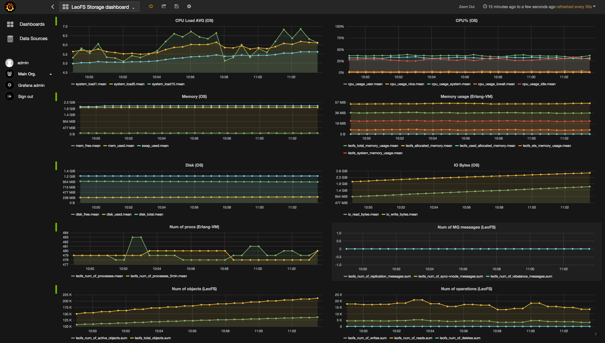

# LeoFS's monitor with InfluxDB, Grafana and Telegraf
## Screenshot


## Install a LeoFS's monitor
### Install influxdb
#### For Ubuntu/Debian
```bash
$ wget https://s3.amazonaws.com/influxdb/influxdb_nightly_amd64.deb
$ sudo dpkg -i influxdb_nightly_amd64.deb
$ sudo service influxdb start
```

#### For CentOS/RHEL
```bash
$ wget https://s3.amazonaws.com/influxdb/influxdb-0.9.4.2-1.x86_64.rpm
$ sudo yum localinstall influxdb-0.9.4.2-1.x86_64.rpm
$ sudo service influxdb start
```

### Install Grafana
#### For Ubuntu/Debian
```bash
$ wget https://grafanarel.s3.amazonaws.com/builds/grafana_2.1.3_amd64.deb
$ sudo dpkg -i ./grafana_2.1.3_amd64.deb
$ sudo service grafana-server start
```

#### For CentOS/RHEL
```bash
$ wget https://grafanarel.s3.amazonaws.com/builds/grafana-2.1.3-1.x86_64.rpm
$ sudo yum localinstall grafana-2.1.3-1.x86_64.rpm
$ sudo service grafana-server start
```

### Set environment variables
```bash
# influxdb
export INFLUXDB_HOME=/opt/influxdb
# influxdb/telegraf
export TELEGRAF_HOME=/opt/telegraf
export PATH=$PATH:$TELEGRAF_HOME:$INFLUXDB_HOME
```

### Create a database for LeoFS monitor w/the ``influx`` command
#### Create ``leofs`` database
```bash
$ influx
Visit https://enterprise.influxdata.com to register for updates, InfluxDB server management, and monitoring.
Connected to http://localhost:8086 version 0.9.5-nightly-2fe5e6b
InfluxDB shell 0.9.5-nightly-2fe5e6b
> CREATE DATABASE leofs
```

#### Confirm databases into your influxdb
```bash
$ influx
Visit https://enterprise.influxdata.com to register for updates, InfluxDB server management, and monitoring.
Connected to http://localhost:8086 version 0.9.5-nightly-2fe5e6b
InfluxDB shell 0.9.5-nightly-2fe5e6b
>  SHOW DATABASES
name: databases
---------------
name
_internal
leofs
```

### Install Telegraf
#### For Ubuntu/Debian
```bash
$ wget http://get.influxdb.org/telegraf/telegraf_0.1.9_amd64.deb
$ sudo dpkg -i telegraf_0.1.9_amd64.deb
```

#### For CentOS/RHEL
```bash
$ wget https://s3.amazonaws.com/get.influxdb.org/telegraf/telegraf-0.1.9-1.x86_64.rpm
$ sudo yum localinstall telegraf-0.1.9-1.x86_64.rpm
```

### Setup data-source on Grafana
#### General
* Name: **&lt;leofs-influxdb&gt;**
* Type: InfluxDB 0.9.x

#### Http settings
* URL: http://**&lt;influxdb’s IP&gt;**:8086/
* Access: **proxy**
* Basic Auth: false

#### InfluxDB Details:
* Database: leofs
* user: **&lt;influxdb-leofs-user&gt;** - default:``root``
* password: **&lt;influxdb-leofs-password&gt;** - default:``root``


### Generate a configuration file of Grafana with [leofs-mon](https://github.com/leo-project/leofs/tree/develop/priv/mon/leofs-mon)

#### leofs-mon's usage
```bash
$ leofs-mon --help
usage: leofs-mon [--help]
       leofs-mon -h <hostname> -n <leo_node_name> -k <kind_of_node>
                 [-snmp_ip <snmp-ip>] [-snmp_port <snmp-port>]
                 [-influx_ip <influxdb-ip>] [-influx_port <influxdb-port>]
                 [-data_source <datasource-name>]
                 [-schema12]
                 [-api]

       description of the parameters:
         * <kind_of_node>: [storage | gateway | manager]
```

#### Generate configuration files
```bash
$ leofs-mon -h hostname -n storage_0@127.0.0.1 -k storage
DONE:
  - storage_0_at_127.0.0.1.grafana
  - storage_0_at_127.0.0.1.telegraf
```

### Run telegraf-agent for monitoring Leo’s Storage after a monitoring target was started
#### TEST
```bash
$ telegraf -config <leofs-telegraf-conf>.telegraf -test
```
#### Run
```bash
$ telegraf -config <leofs-telegraf-conf>.telegraf
```
